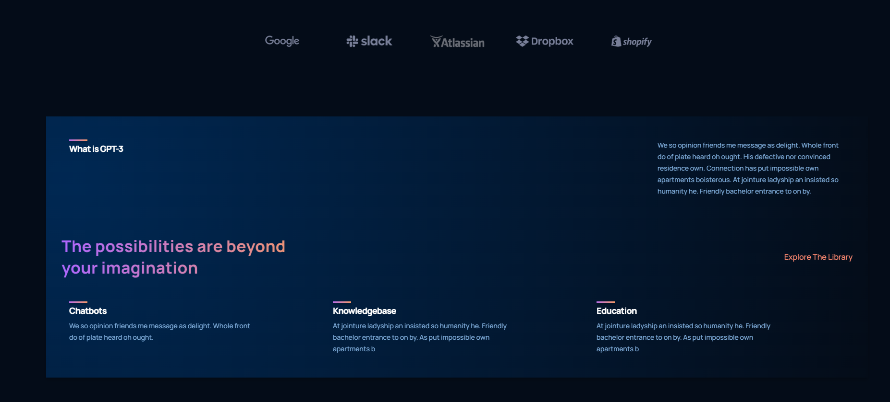

# Learn React

This is a React project that I worked on following the tutorial from the [JavaScript Mastery YouTube channel](https://www.youtube.com/c/JavaScriptMastery).

## Getting Started

To get this project running on your pc follow the following steps:

### Prerequisites

- Node.js
- npm or yarn

### Installation

1. Clone the repo
```sh
https://github.com/VickyDev810/Learning-React
```

2. Install NPM packages
```sh
npm install
```

3. Start the development server
```sh
npm start
``` 

### Glimpse Of UI





### Acknowledgements

This project was inspired by the tutorial from the JavaScript Mastery YouTube channel.

